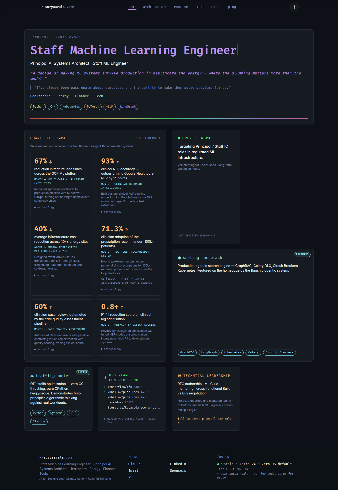
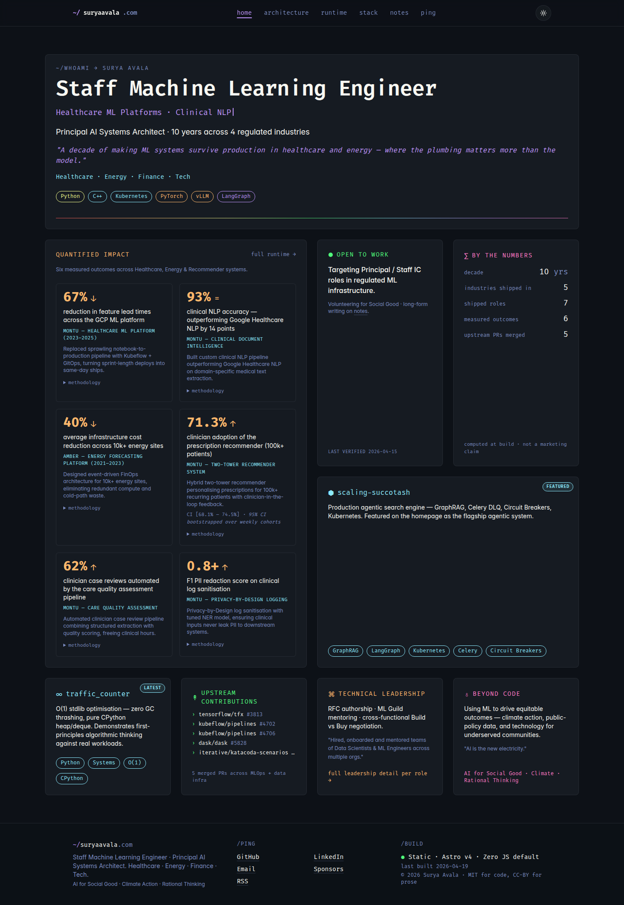
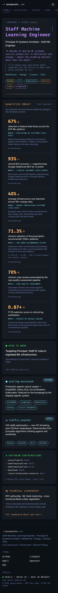
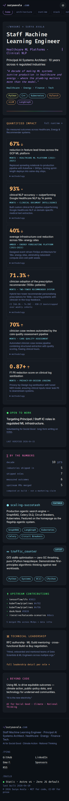
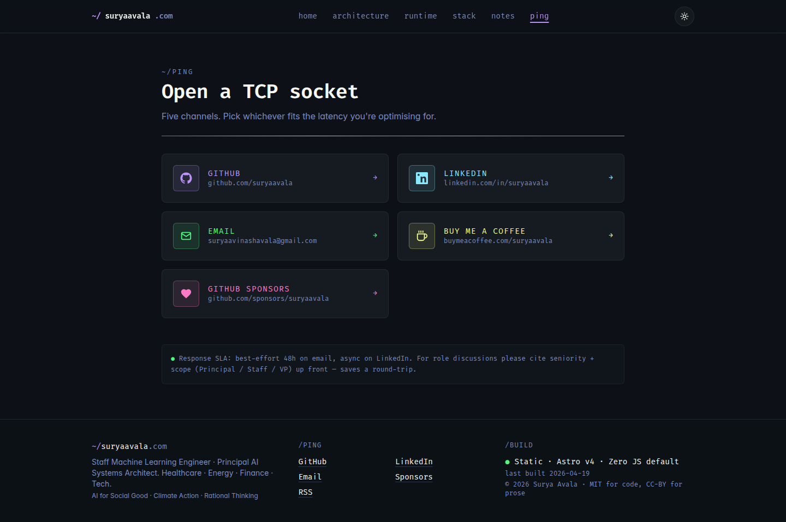
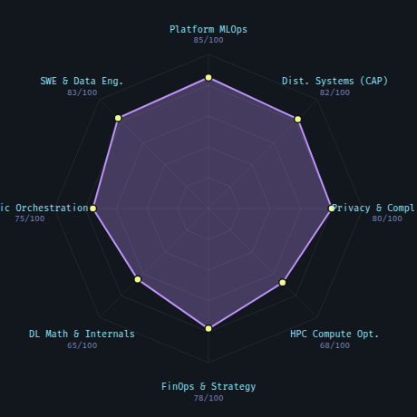
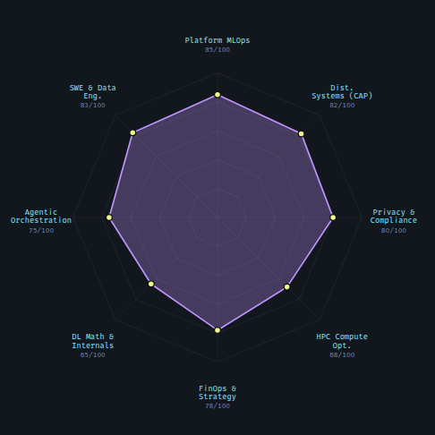

# Visual diff — `claude/sweet-sammet` last two commits

Before / after of the UI changes landed by the last two commits on `claude/sweet-sammet`.

| SHA | Subject |
| --- | --- |
| `b08eb0d` | `fix(ux): DistinguishedMentor review — hero a11y, grid fill, icon glyphs, radar labels` |
| `138e9b3` | `style: prettier auto-format index.astro + ping.astro` |

**Before** = tree at `76f49d2` (parent of `b08eb0d`).
**After** = tree at `138e9b3` (tip).

Commit `138e9b3` is whitespace-only (prettier), so the visible UI diff is entirely attributable to `b08eb0d`. All captures: viewport dark theme, chromium headless, `npm run preview`.

---

## 1. Homepage (`/`) — desktop 1440×900

Five things change in the hero and Bento grid:

1. `<h1>` becomes a static string. The typing animation moves to an `aria-hidden` sibling `
` below it.
2. Hero subtitle changes from `"Principal AI Systems Architect · Staff ML Engineer"` → `"… · 10 years across 4 regulated industries"`.
3. A pull-quote beneath the tagline is removed.
4. Two empty Bento cells are filled: **"By the Numbers"** (top-right) and **"Beyond Code"** (bottom-right).
5. Cards renumber/reflow to keep the 4×4 grid coherent.

### Before

### After

---

## 2. Homepage (`/`) — mobile 390×844

Same content changes, stacked. Note the H1 cursor disappearing, the typing animation relocating to the subtitle line, and the two new cards at the bottom.

### Before

### After

---

## 3. `/ping` — desktop

Channel icons swap from single-character glyphs (Fira Code couldn't render `⌥` / `☕` / `♥`, so they rendered as tofu or incorrect fallbacks) to per-channel inline SVGs tinted with the accent token. The layout itself is unchanged.

### Before

### After

---

## 4. `/stack` — competency radar (close-up)

`RadarChart.svelte` gains a `labelPadding` prop (default 56px) and a `splitLabel()` helper. The `viewBox` expands to make room, and labels longer than 14 chars wrap onto two `<tspan>` lines. The chart geometry is unchanged.

Most visible fix: `"Agentic Orchestration"` and `"Privacy & Compliance"` were being truncated at the SVG edge.

### Before — labels clipped

You can see `ic Orchestration` (the "Agent" prefix is cut off) and `Privacy & Compl` (the "iance" suffix is cut off).

### After — labels wrap, fully legible

All 8 axis labels now fit inside the viewBox; longer ones wrap onto two lines.

---

## Method

- Checked out `76f49d2`, `npm ci`, `npm run build && npm run preview`, captured 4 PNGs via Playwright (system chromium).
- Checked out `138e9b3`, rebuilt, re-captured.
- Radar close-up via `page.locator('figure[aria-label*="radar"]').screenshot()`.
- All captures with `localStorage.theme = 'dark'` seeded pre-navigation.

## Not captured

- `138e9b3` is whitespace-only — no pixel diff from `b08eb0d`.
- Tablet breakpoint was omitted (desktop + mobile covers the reflow story for this change).
- Light theme was omitted for the same reason — the content/layout diff is theme-independent.
- The 6 darwin visual baselines in `tests/e2e/visual.spec.ts-snapshots/` are shipped for CI visual-regression enforcement; they capture the same pages as above.
